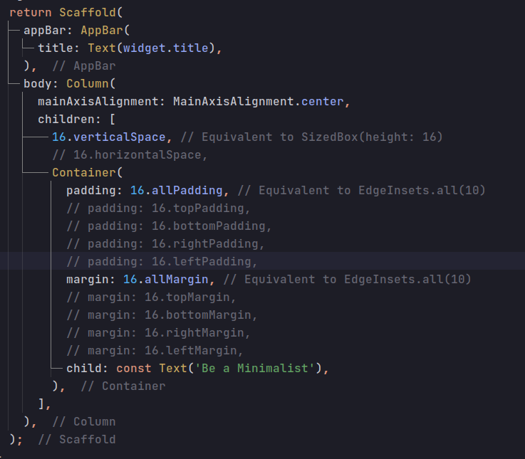

Provide some technique and simplified functionalities to minimize some frequently used Flutter/Dart code to maximize productivity and maintain a readable codebase.

Brings together some basic and frequently used methods for easy to access.

## Features

* Functionalities as extension.
* Minimal code.
* Maximize productivity.
* More meaningful and readable code structure.




## Getting started

Include dependency in your pubspec.yaml file

```yml
dependencies:
  flutter:
    sdk: flutter
  # add flutter_address_from_latlng
  flutter_minimalist: ^(updated version)
```

## Usage

For some spacing whether its like margin or padding inside ```Row()``` or ```Column()``` widget just call getters on ```num```

```dart
Column(
  children: [
    16.verticalSpace, // Equivalent to SizedBox(height: 16)
    /// Some widgets
    16.verticalSpace, // // Equivalent to SizedBox(height: 16)
    Row(
      children: [
        16.horizontalSpace, // Equivalent to SizedBox(width: 16)
        // Some Widgets
        16.horizontalSpace, // Equivalent to SizedBox(width: 16)
        // Some widgets
      ]
    ),
  ]
)
```

For Margin and padding just call getters on ```num```

```dart
// for all padding and margin
Contianer(
  padding: 16.allPadding,
  margin: 16.allMargin,
)

// for left padding and margin
Contianer(
  padding: 16.leftPadding,
  margin: 16.leftMargin,
)
```

Simplify ```Duration()``` like

```dart
void example(){
  1.seconds; // Equivalent to Duration(seconds: 16)
  1000.milliSeconds; // Equivalent to Duration(milliseconds: 16)
  1000000.microSeconds;
  2.minutes;
  1.hours;
}
```

Ue ```Future.delay()``` more minimalistic way

```dart
void example() {
  1000.milliSeconds.delay.then((val){
    //Do your work after 10 seconds delay
  });
}
```

## Contributing

Contributions are welcome! If you'd like to contribute, please fork the repository
on [GitHub](https://github.com/saiful00000/flutter_minimalist) and submit a pull request.

## Issues

If you encounter any issues or bugs, please feel free
to [file an issue](https://github.com/saiful00000/flutter_minimalist/issues) on the github issue
tracker. We'll do our best to address the issue in a timely manner.

## Support

If you have any questions or need help with the package, contact [saiful161003@gmail.com](saiful161003@gmail.com).

## License

This package is released under the [MIT License](https://github.com/saiful00000/flutter_minimalist/blob/master/LICENSE)
